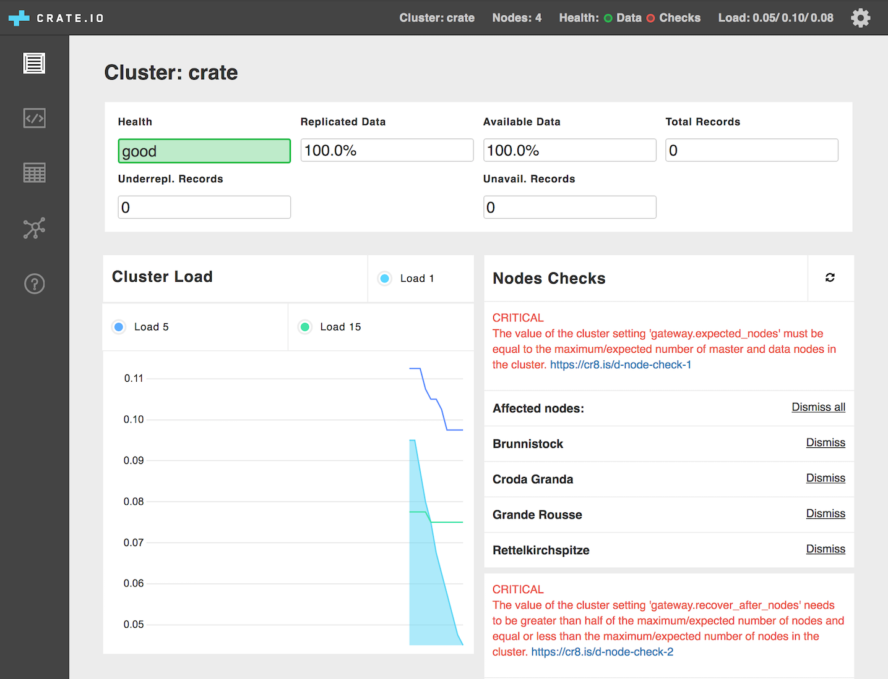

# Habitat Package: Crate
Endocode Habitat Maintainers <habitat@endocode.com>

## Description

- [www](https://crate.io)
- [Docs](https://crate.io/docs/reference/)

> CrateDB combines SQL and search in a way that’s simple to scale.

CrateDB is an open source SQL database with a ground-breaking distributed design:

- Uses SQL to process any type of data, structured or unstructured;
- Performs distributed SQL queries at realtime speed, even JOINs and aggregates;
- Makes scaling simple

## Usage

- On the first node: `hab sup start endocode/crate --topology leader`
- On subsequent nodes: `hab sup start endocode/crate --topology leader --peer <first node ip>`

On all nodes the following ports are available:

- **4200**: HTTP port for access to the admin interface through your web browser
- **4300**: inter-node communication port
- **5432**: Postgres protocol communication port for connecting clients

### Errors After Starting Crate

After you first start CrateDB it is likely that you will receive some
errors related to Crate's in-built election algorithm:



These errors can be fixed by applying a specific config to the service group:

```bash
[gateway]
  expected_nodes = 
  recover_after_nodes =
```
Copy the above config into a TOML file and set the value of these config options according the instructions in the administration interface and then apply them:

`hab config apply --peer <first node ip> crate.default 1 <your.toml>`

### Notes

- CrateDB has a _lot_ of configuration. This package has been designed to minimise the amount of configuration that needs to be adjusted by the administrator.
- The configuration for this plan has been written so that the lead Habitat supervisor will always been the CrateDB master node.
- hab v0.22/0.23 due to a bug in domain resolution inside these versions of Habitat, CrateDB can be slower than expected in building clusters and applying configuration updates. After the cluster is built, overall database performance is unaffected.