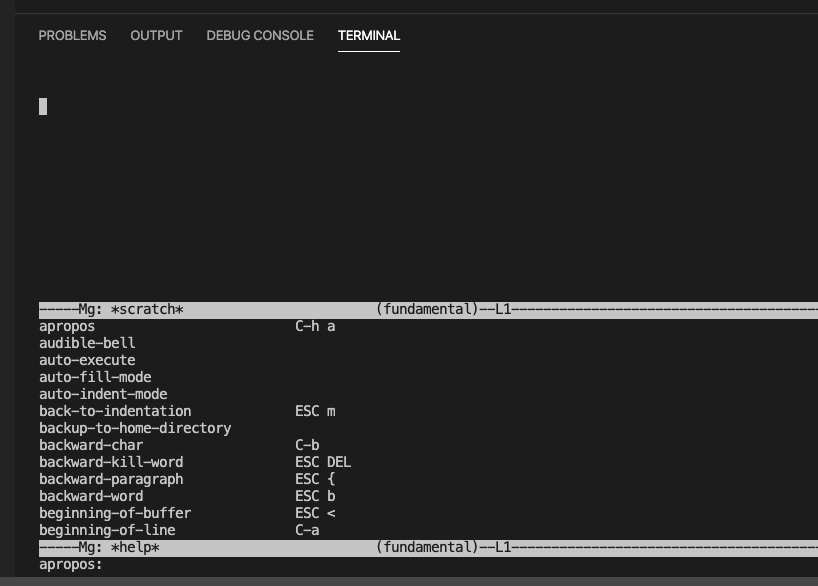

[](https://dev.azure.com/chefcorp-partnerengineering/Chef%20Base%20Plans/_build/latest?definitionId=171&branchName=master)

# mg

mg is Micro GNU/emacs, this is a portable version of the mg maintained by the OpenBSD team.  See [documentation](https://github.com/hboetes/mg)

## Maintainers

* The Core Planners: <chef-core-planners@chef.io>

## Type of Package

Binary package

### Use as Dependency

Binary packages can be set as runtime or build time dependencies. See [Defining your dependencies](https://www.habitat.sh/docs/developing-packages/developing-packages/#sts=Define%20Your%20Dependencies) for more information.

To add core/mg as a dependency, you can add one of the following to your plan file.

##### Buildtime Dependency

> pkg_build_deps=(core/mg)

##### Runtime dependency

> pkg_deps=(core/mg)

### Use as Tool

#### Installation

To install this plan, you should run the following commands to first install, and then link the binaries this plan creates.

``hab pkg install core/mg --binlink``

will add the following binary to the PATH:

* /bin/mg

For example:

```bash
$ hab pkg install core/mg --binlink
» Installing core/mg
☁ Determining latest version of core/mg in the 'stable' channel
→ Found newer installed version (core/mg/20180408/20200624224252) than remote version (core/mg/20180408/20200306015846)
→ Using core/mg/20180408/20200624224252
★ Install of core/mg/20180408/20200624224252 complete with 0 new packages installed.
» Binlinking mg from core/mg/20180408/20200624224252 into /bin
★ Binlinked mg from core/mg/20180408/20200624224252 to /bin/mg
```

#### Using an example binary

You can now use the binary as normal.  For example, to enter the mg terminal type

``mg``

and then ``Ctrl+h`` twice to view help.  You should see something like the following:


