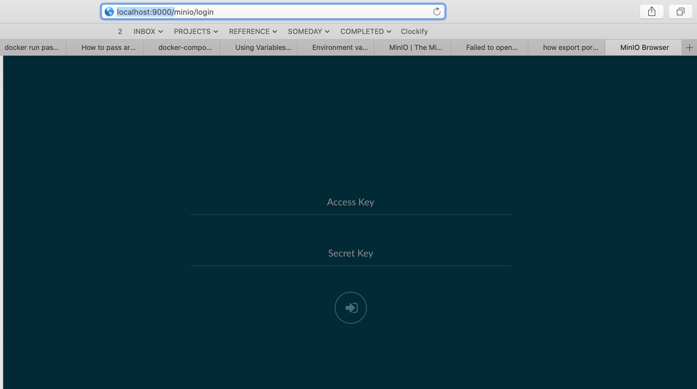

[](https://dev.azure.com/chefcorp-partnerengineering/Chef%20Base%20Plans/_build/latest?definitionId=116&branchName=master)

# minio

Minio is a high performance distributed object storage server, designed for large-scale private cloud infrastructure.  See [documentation](https://docs.min.io)

## Maintainers

The Core Planners: <chef-core-planners@chef.io>

## Type of Package

Service package

### Use as a habitat service

Simple usage from a hab studio:

```bash
$ # build and install
$ build .
$ source ./results/last_build.env
$ hab pkg install ./results/$pkg_artifact
$
$ # load as a service in studio
$ hab svc load core/minio
$
$ # export and run as a docker container
$ hab pkg install core/docker core/hab-pkg-export-docker
$ hab pkg export docker ./results/$pkg_artifact
$ hab pkg exec core/docker docker run --name core_minio -p 9000:9000 --rm -de HAB_LICENSE=accept core/minio
```

And load up the following in a browser:

``http://localhost:9000``

which should produce something like the following:



For more information see:

* [Running Chef Habitat Packages](https://www.habitat.sh/docs/using-habitat/using-packages/) for more information.
* [Service Groups](https://www.habitat.sh/docs/using-habitat/service-groups/)
* [Topologies](https://www.habitat.sh/docs/using-habitat/topologies/)
* [Update Strategy](https://www.habitat.sh/docs/using-habitat/using-updates/)
* [Binds and Exports](https://www.habitat.sh/docs/developing-packages/#runtime-binds-and-exports)